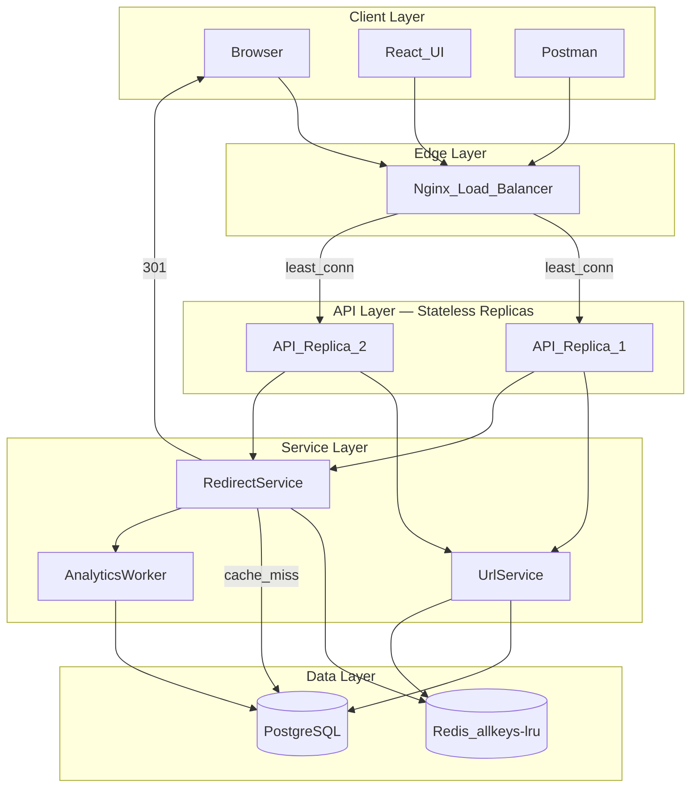
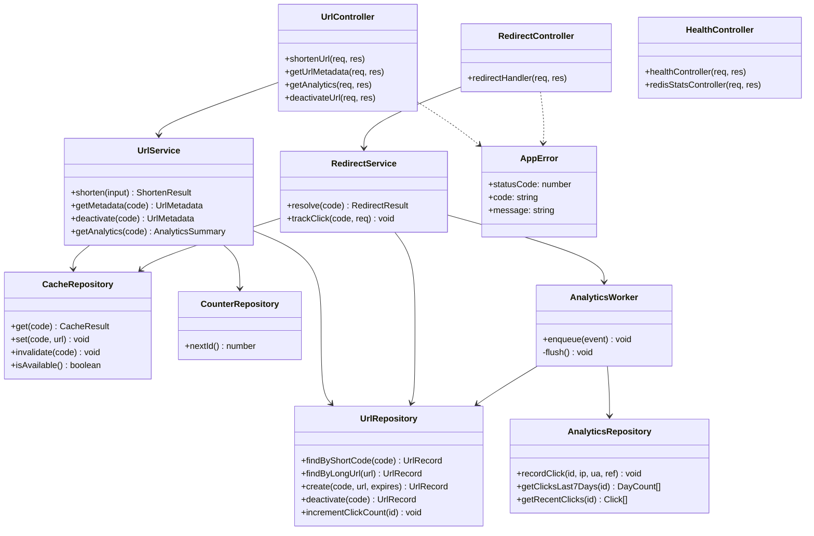
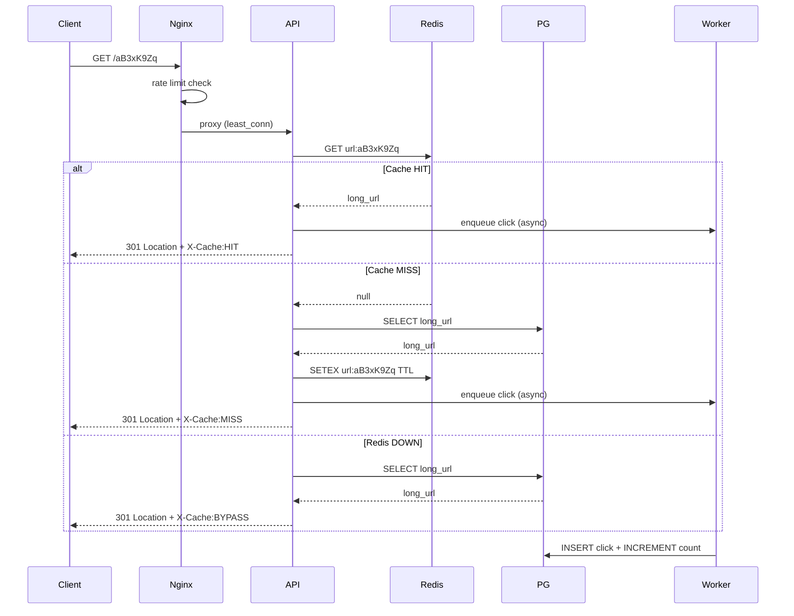

# TinyURL — Enterprise URL Shortener

A production-grade distributed URL shortening platform built with **React**, **Node.js (TypeScript)**, **PostgreSQL**, **Redis**, **Nginx**, and **Docker**. Supports high-throughput URL creation, **301 permanent redirects**, cache-aside caching, Base62 encoding with random security suffix, dual-layer rate limiting, and asynchronous click analytics.

---

## Architecture Overview



### Deployment Topology

| Mode | Command | Access |
|------|---------|--------|
| **Local dev** | `npm run dev:all` | API `:3001`, UI `:5173` |
| **Docker infra** | `docker compose up -d` | Redis `:6379`, PG `:5433` |
| **Full stack + Nginx** | `docker compose --profile full up -d` | Everything via `:80` |

---

## Class Diagram — Backend



---

## Sequence Diagram — Redirect with Cache-Aside



---

## Security

### Defense in Depth (3 layers)

| Layer | Protection | Implementation |
|-------|-----------|----------------|
| **Nginx (edge)** | Rate limiting, connection limits, path blocking | `nginx/nginx.conf` |
| **Express (app)** | Helmet headers, CORS, body size limit, IP rate limits | `middleware/` |
| **Business logic** | SSRF prevention, input validation, reserved aliases | `urlValidator.ts` |

### Nginx Security Features

- **Rate limiting zones:** `shorten` 5r/s · `redirect` 100r/s · `api` 30r/s
- **Connection limit:** 20 concurrent per IP
- **Blocked paths:** `.git`, `.env`, `wp-admin`, `.php` probes
- **Security headers:** `X-Frame-Options`, `X-Content-Type-Options`, `Referrer-Policy`, `Permissions-Policy`
- **Load balancing:** `least_conn` across 2 API replicas with health failover

### Application Security Features

- **SSRF blocking** — rejects URLs pointing to `localhost`, `127.x`, `10.x`, `192.168.x`, `172.16-31.x`
- **Protocol blocking** — rejects `javascript:`, `data:`, `file:` URLs
- **Reserved aliases** — blocks `api`, `health`, `admin`, `login`
- **Request ID tracing** — `X-Request-Id` on every request/response
- **IP hashing** — click analytics store SHA-256 hashed IPs (privacy)
- **Non-predictable codes** — Base62 + 2-char random suffix

### Dual Rate Limiting

| Endpoint | Nginx | Express |
|----------|-------|---------|
| `POST /api/v1/urls` | 5 req/s | 20 req/min |
| `GET /:shortCode` | 100 req/s | 200 req/min |
| `GET /api/*` | 30 req/s | 100 req/15min |

---

## Redis Policy

### Strategy: Cache-Aside (Lazy Loading)

The application — not Redis — owns cache population and invalidation.

```
READ:  App → Redis GET → [miss] → PG SELECT → Redis SETEX → return
WRITE: App → PG INSERT → Redis SETEX (warm cache)
DELETE: App → PG UPDATE is_active → Redis DEL
```

### Redis Server Configuration (`redis/redis.conf`)

| Setting | Value | Purpose |
|---------|-------|---------|
| `maxmemory` | 256 MB | Cap memory usage |
| `maxmemory-policy` | **allkeys-lru** | Evict least-recently-used keys when full |
| `save` | 900/300/60 snapshots | RDB persistence for counter recovery |
| `appendonly` | no | Performance over AOF durability |
| Key pattern | `url:{shortCode}` | String value = long URL |
| Counter key | `url:counter` | Redis INCR for distributed ID generation |
| TTL | 86400s (24h) | Per-key expiry via `SETEX` |

### Cache Response Headers

Every redirect includes observability headers:

| Header | Values | Meaning |
|--------|--------|---------|
| `X-Cache` | `HIT` | Served from Redis |
| `X-Cache` | `MISS` | PostgreSQL lookup, cache populated |
| `X-Cache` | `BYPASS` | Redis unavailable, PostgreSQL only |
| `X-Response-Time` | e.g. `2.45ms` | Server-side resolve latency |
| `X-Request-Id` | UUID | Correlation ID for debugging |

### Inspect Cache Stats

```
GET /api/v1/cache/stats
```

```json
{
  "strategy": "cache-aside",
  "evictionPolicy": "allkeys-lru",
  "maxMemory": "256.00M",
  "usedMemory": "1.02M",
  "keyPattern": "url:{shortCode}",
  "ttlSeconds": 86400
}
```

---

## Redis Latency Benchmark

Compare redirect performance with and without Redis:

```bash
# Ensure backend is running
npm run dev:backend

# Test CACHE HIT + CACHE MISS (50 iterations each)
npm run benchmark

# Test BYPASS (Redis down)
docker compose stop redis
npm run benchmark:redis-down
docker compose start redis
```

**Expected results (approximate):**

| Scenario | X-Cache | Typical Latency |
|----------|---------|-----------------|
| Redis HIT | `HIT` | 1–5 ms |
| Redis MISS | `MISS` | 10–30 ms (PG query) |
| Redis DOWN | `BYPASS` | 10–30 ms (PG only, no cache write) |

Configure via env: `BENCHMARK_URL`, `BENCHMARK_ITERATIONS`.

---

## Error Handling

All errors return a consistent JSON envelope with optional `requestId`:

```json
{
  "error": true,
  "code": "NOT_FOUND",
  "message": "Short link not found",
  "requestId": "a1b2c3d4-..."
}
```

### Error Code Reference

| HTTP | Code | When |
|------|------|------|
| 400 | `INVALID_URL` | Malformed or blocked URL |
| 400 | `SSRF_BLOCKED` | Private/local network URL |
| 400 | `INVALID_ALIAS` | Bad custom alias format |
| 400 | `VALIDATION_ERROR` | Zod schema failure |
| 403 | `FORBIDDEN` | Suspicious path blocked |
| 404 | `NOT_FOUND` | Short code or endpoint missing |
| 409 | `ALIAS_TAKEN` | Custom alias already exists |
| 409 | `DUPLICATE_ENTRY` | Database unique constraint |
| 410 | `LINK_EXPIRED` | Past expiration date |
| 410 | `LINK_INACTIVE` | Soft-deleted link |
| 414 | `URI_TOO_LONG` | Request URI exceeds 2048 chars |
| 429 | `RATE_LIMIT_EXCEEDED` | Nginx or Express rate limit |
| 500 | `INTERNAL_ERROR` | Unhandled server error |
| 503 | `DATABASE_UNAVAILABLE` | PostgreSQL connection lost |
| 503 | `REDIS_UNAVAILABLE` | Redis stats endpoint when down |

### Patterns Used

- **`AppError`** — typed business errors with HTTP status + code
- **`asyncHandler`** — wraps async controllers, forwards errors to global handler
- **`mapDatabaseError`** — translates PG connection errors to 503
- **Graceful Redis degradation** — cache failures fall through to PostgreSQL (`BYPASS`)

---

## Functional Requirements

| ID | Requirement | Status |
|----|-------------|--------|
| FR-1 | Shorten a long URL into a unique, compact code | Done |
| FR-2 | Redirect short code to original URL via **HTTP 301** | Done |
| FR-3 | Optional custom alias (3–12 chars) | Done |
| FR-4 | Configurable link expiration (default 5 years) | Done |
| FR-5 | Soft-deactivate links | Done |
| FR-6 | Click tracking and analytics dashboard | Done |
| FR-7 | Health check endpoint | Done |
| FR-8 | Nginx load balancer with API replicas | Done |
| FR-9 | Redis latency observability | Done |

## Non-Functional Requirements

| ID | Requirement | Implementation |
|----|-------------|----------------|
| NFR-1 | High availability | Nginx LB, stateless API replicas, PG source of truth |
| NFR-2 | Low redirect latency | Redis cache-aside, sub-10ms on cache hit |
| NFR-3 | Non-predictable short codes | Base62(counter) + 2-char random suffix |
| NFR-4 | Read-heavy optimization | 100:1 read/write ratio, aggressive caching |
| NFR-5 | Rate limiting | Dual-layer Nginx + Express limits |
| NFR-6 | Security | SSRF block, Helmet, request IDs, IP hashing |
| NFR-7 | Scalability | Redis INCR counter, horizontal API scaling |
| NFR-8 | Observability | X-Cache, X-Response-Time, structured logging |
| NFR-9 | Graceful degradation | Redis down → PostgreSQL bypass, no crash |

---

## API Reference

Base URL: `http://localhost:3001` (or `http://localhost` via Nginx)

| Method | Endpoint | Description |
|--------|----------|-------------|
| `POST` | `/api/v1/urls` | Shorten URL |
| `GET` | `/api/v1/urls/:shortCode` | Get metadata |
| `GET` | `/api/v1/urls/:shortCode/analytics` | Click analytics |
| `DELETE` | `/api/v1/urls/:shortCode` | Deactivate link |
| `GET` | `/api/v1/cache/stats` | Redis cache policy info |
| `GET` | `/:shortCode` | 301 redirect |
| `GET` | `/health` | Service health |

---

## Local Setup

### Prerequisites

- Node.js 20+
- Docker (Redis, optional Postgres, Nginx full stack)

### Quick Start

```bash
cp .env.example .env
docker compose up -d
npm install && cd backend && npm install && cd ..
npm run dev:all
```

Open `http://localhost:5173`

### Full Stack with Nginx Load Balancer

```bash
docker compose --profile full up -d --build
```

Access via `http://localhost` — Nginx routes to 2 API replicas + React frontend.

### Environment Variables

| Variable | Default | Description |
|----------|---------|-------------|
| `DATABASE_URL` | — | PostgreSQL connection string |
| `REDIS_URL` | `redis://localhost:6379` | Redis connection |
| `PORT` | `3001` | API server port |
| `BASE_URL` | `http://localhost:3001` | Short URL base |
| `REDIS_TTL_SECONDS` | `86400` | Cache TTL (24 hours) |
| `VITE_API_URL` | `http://localhost:3001` | Frontend API target |
| `BENCHMARK_ITERATIONS` | `50` | Benchmark sample size |

---

## Project Structure

```
tiny-url-shortner/
├── backend/src/
│   ├── config/           # env, db, redis, logger
│   ├── controllers/      # HTTP handlers
│   ├── services/         # business logic
│   ├── repositories/     # data access (PG + Redis)
│   ├── routes/           # API routes
│   ├── middleware/       # security, rate-limit, errors, requestId
│   ├── workers/          # async analytics queue
│   ├── scripts/          # migrate, benchmark
│   └── utils/            # base62, validators
├── nginx/nginx.conf      # load balancer + rate limits
├── redis/redis.conf      # allkeys-lru policy
├── src/                  # React frontend
├── postman/              # API collection
└── docker-compose.yml    # Redis, PG, API×2, Nginx
```

---

## References

- [GeeksforGeeks — URL Shortener System Design](https://www.geeksforgeeks.org/system-design-url-shortening-service/)
- [InterviewLoop — Design a URL Shortener](https://interviewloop.app/learn/system-design/1-design-a-url-shortener-tinyurl)
- [Hello Interview — Design Bitly](https://www.hellointerview.com/learn/system-design/problem-breakdowns/bitly)

---

## License

MIT
