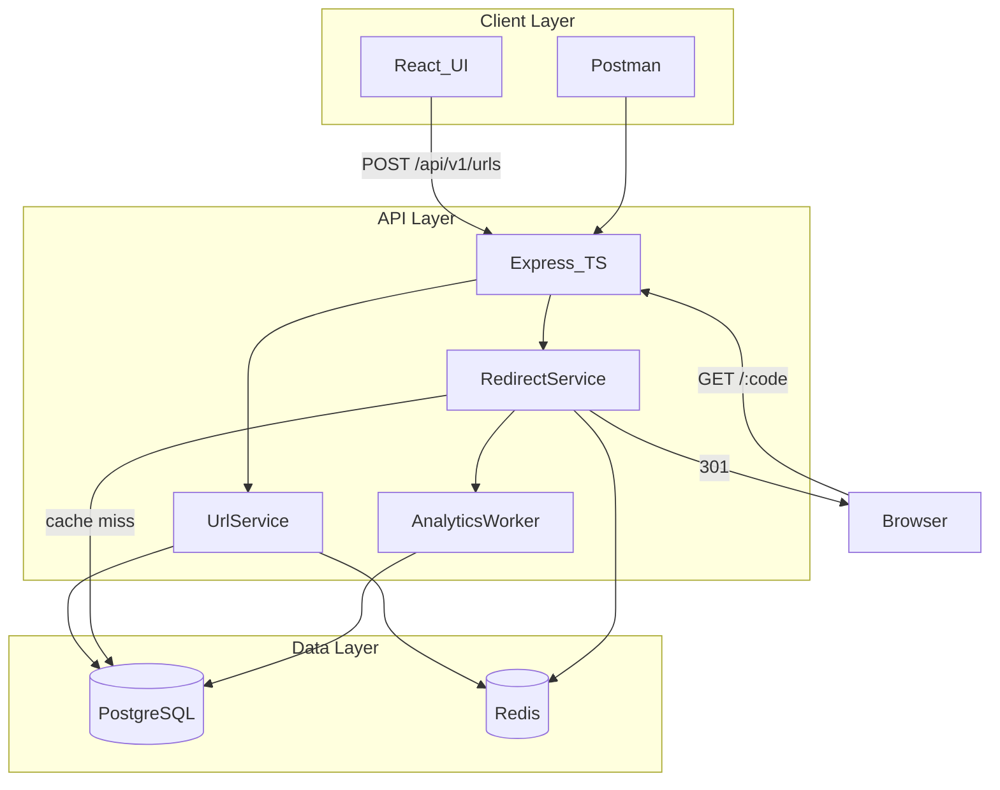

# TinyURL — Enterprise URL Shortener

A production-grade distributed URL shortening platform built with **React**, **Node.js (TypeScript)**, **PostgreSQL**, **Redis**, and **Docker**. Supports high-throughput URL creation, **301 permanent redirects**, cache-aside caching, Base62 encoding with random security suffix, and asynchronous click analytics.

---

## Architecture



### Components

| Component | Role |
|-----------|------|
| **React UI** | Shorten URLs, manage links, view analytics |
| **Express API** | REST endpoints + redirect handler |
| **PostgreSQL** | Persistent URL mappings and click records |
| **Redis** | Cache-aside for hot redirects + distributed counter |
| **Analytics Worker** | Async click processing (non-blocking) |

### Design Patterns

- **Layered architecture** — Controller → Service → Repository
- **Cache-aside** — Read Redis first, fallback to DB, populate cache on miss
- **Repository pattern** — Isolated data access for PG and Redis
- **Async queue** — Decoupled analytics from redirect hot path

---

## Functional Requirements

| ID | Requirement | Status |
|----|-------------|--------|
| FR-1 | Shorten a long URL into a unique, compact code | Done |
| FR-2 | Redirect short code to original URL via **HTTP 301** | Done |
| FR-3 | Optional custom alias (3–12 chars) | Done |
| FR-4 | Configurable link expiration (default 5 years) | Done |
| FR-5 | Soft-deactivate links | Done |
| FR-6 | Click tracking and analytics dashboard | Done |
| FR-7 | Health check endpoint | Done |

## Non-Functional Requirements

| ID | Requirement | Implementation |
|----|-------------|----------------|
| NFR-1 | High availability | Stateless API, Redis cache, PG as source of truth |
| NFR-2 | Low redirect latency | Redis cache-aside, target sub-10ms on cache hit |
| NFR-3 | Non-predictable short codes | Base62(counter) + 2-char random suffix |
| NFR-4 | Read-heavy optimization | 100:1 read/write ratio, aggressive caching |
| NFR-5 | Rate limiting | 20 shorten/min, 200 redirect/min, 100 API/15min |
| NFR-6 | Scalability | Redis INCR counter, horizontal API scaling ready |
| NFR-7 | Portability | Docker for Redis, CI/CD-ready backend Dockerfile |

---

## Tech Stack

- **Frontend:** React 19, React Router, Vite, Lucide icons
- **Backend:** Node.js, TypeScript, Express, Zod validation
- **Database:** PostgreSQL (`shortner`)
- **Cache:** Redis 7 (Docker)
- **DevOps:** Docker Compose, GitHub Actions CI

---

## Short Code Algorithm

Per [GeeksforGeeks URL Shortener design](https://www.geeksforgeeks.org/system-design-url-shortening-service/):

1. Get next ID via Redis `INCR url:counter` (fallback: PostgreSQL sequence)
2. Encode ID to **Base62** (`0-9`, `a-z`, `A-Z`) — e.g. `aB3xK9`
3. Append **2 random Base62 characters** — e.g. `Zq` (prevents enumeration)
4. Final code: `aB3xK9Zq`

7 Base62 chars ≈ 3.5 trillion combinations. Collision retry up to 3 attempts.

---

## Caching Strategy

**Cache-aside pattern** (read-through on miss):

```
GET /:shortCode
  → Redis GET url:{code}
  → [hit] return long URL
  → [miss] PostgreSQL SELECT → Redis SETEX (TTL 24h) → return
```

- **TTL:** 24 hours (`REDIS_TTL_SECONDS=86400`)
- **Invalidation:** On link deactivation, `DEL url:{code}`
- **Target hit rate:** 95%+ for hot links

---

## 301 vs Analytics Tradeoff

This system uses **HTTP 301 Permanent Redirect** for performance.

- **First click:** Server handles redirect and records analytics
- **Repeat clicks:** Browser may cache the 301 and skip the server entirely
- **Implication:** Analytics under-count repeat visits from the same browser

For full click tracking on every visit, use 302 instead. We chose 301 per performance requirements.

---

## API Reference

Base URL: `http://localhost:3001`

### `POST /api/v1/urls` — Shorten URL

```json
// Request
{
  "longUrl": "https://example.com/very/long/path",
  "customAlias": "my-link",   // optional
  "expiresInDays": 365        // optional
}

// Response 201
{
  "success": true,
  "data": {
    "shortCode": "aB3xK9Zq",
    "shortUrl": "http://localhost:3001/aB3xK9Zq",
    "longUrl": "https://example.com/very/long/path",
    "expiresAt": "2027-06-15T00:00:00.000Z",
    "createdAt": "2026-06-15T00:00:00.000Z"
  }
}
```

### `GET /api/v1/urls/:shortCode` — Get metadata

### `GET /api/v1/urls/:shortCode/analytics` — Click analytics

### `DELETE /api/v1/urls/:shortCode` — Deactivate link

### `GET /:shortCode` — 301 redirect to original URL

### `GET /health` — Service health

```json
{
  "status": "healthy",
  "services": { "database": "up", "redis": "up" }
}
```

### Error format

```json
{
  "error": true,
  "code": "NOT_FOUND",
  "message": "Short link not found"
}
```

---

## Local Setup

### Prerequisites

- Node.js 20+
- PostgreSQL with database `shortner` created
- Docker (for Redis)

### 1. Clone and configure

```bash
cp .env.example .env
# Edit .env — set your PostgreSQL password in DATABASE_URL
```

### 2. Start Redis (and optional Docker PostgreSQL)

```bash
docker compose up -d
```

> **Local PostgreSQL:** If you use your own `shortner` database on port 5432, set `DATABASE_URL` in `.env` accordingly.
>
> **Docker PostgreSQL:** Included on port **5433** with password `password` — ready out of the box.

### 3. Install dependencies

```bash
npm install
cd backend && npm install && cd ..
```

### 4. Run migrations (auto-runs on server start, or manually)

```bash
npm run migrate
```

### 5. Start development

```bash
# Both frontend + backend
npm run dev:all

# Or separately:
npm run dev:backend   # http://localhost:3001
npm run dev:frontend  # http://localhost:5173
```

### Environment Variables

| Variable | Default | Description |
|----------|---------|-------------|
| `DATABASE_URL` | — | PostgreSQL connection string |
| `REDIS_URL` | `redis://localhost:6379` | Redis connection |
| `PORT` | `3001` | API server port |
| `BASE_URL` | `http://localhost:3001` | Short URL base (redirect server) |
| `DEFAULT_EXPIRY_DAYS` | `1825` | Default link TTL (5 years) |
| `REDIS_TTL_SECONDS` | `86400` | Cache TTL (24 hours) |
| `VITE_API_URL` | `http://localhost:3001` | Frontend API target |

---

## Postman

Import [`postman/TinyURL-Shortener.postman_collection.json`](postman/TinyURL-Shortener.postman_collection.json).

Collection variables:
- `baseUrl` — `http://localhost:3001`
- `shortCode` — auto-set after shorten request

Folders: Health, URL Management, Redirect, Analytics.

---

## Project Structure

```
tiny-url-shortner/
├── backend/
│   ├── src/
│   │   ├── config/          # env loader, db, redis, logger
│   │   ├── controllers/     # HTTP handlers
│   │   ├── services/        # business logic
│   │   ├── repositories/    # data access
│   │   ├── routes/          # API routes
│   │   ├── middleware/      # validation, rate-limit, errors
│   │   ├── workers/         # async analytics
│   │   └── utils/           # base62, validators
│   └── migrations/          # SQL schema
├── src/                     # React frontend
├── postman/                 # API collection
├── docker-compose.yml       # Redis
└── README.md
```

---

## References

- [GeeksforGeeks — URL Shortener System Design](https://www.geeksforgeeks.org/system-design-url-shortening-service/)
- [InterviewLoop — Design a URL Shortener](https://interviewloop.app/learn/system-design/1-design-a-url-shortener-tinyurl)
- [Hello Interview — Design Bitly](https://www.hellointerview.com/learn/system-design/problem-breakdowns/bitly)

---

## License

MIT
